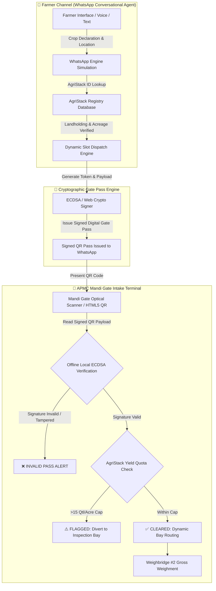

# AgriLogistics (KrishiQ)

> **Offline-Verifiable Digital Mandi Gate Intake & Smart Ingress Dispatch System**

[](https://nextjs.org/)
[](https://www.typescriptlang.org/)
[](https://tailwindcss.com/)
[](https://vercel.com/)


---

## 📌 Problem Statement

At Indian Agricultural Produce Market Committee (**APMC**) mandis, peak harvest seasons generate extreme logistical gridlock. Thousands of tractors, mini-trucks, and commercial carriers arrive simultaneously at physical gate checkpoints, creating multi-hour queues that stall regional supply chains, degrade perishable produce, and inflate transport costs.

```
┌────────────────────────────────────────────────────────────────────────────────────────┐
│                                   APMC MANDI BOTTLENECKS                               │
├───────────────────────────────┬────────────────────────────────┬───────────────────────┤
│    Multi-Hour Truck Queues    │      Manual Paper Passes       │ Gate Network Dropouts │
├───────────────────────────────┼────────────────────────────────┼───────────────────────┤
│ Uncoordinated peak arrivals   │ Manual paper slips vulnerable  │ Frequent rural 2G/3G  │
│ cause 4-8 hour gate congestion│ to forgery, loss, and slow     │ outages crash cloud-  │
│ and perishable crop decay.    │ physical verification.         │ dependent gate portals│
└───────────────────────────────┴────────────────────────────────┴───────────────────────┘
```

### Why Existing Solutions Fail

1. **Standalone Mobile Apps Fail Smallholder Farmers:**
   - **Storage & Hardware Constraints:** Low-cost smartphones lack space for heavy native apps.
   - **Digital Literacy & Onboarding Friction:** Complex app downloads, app store accounts, and multi-step OTP registrations discourage adoption among rural farmers.
   - **Vernacular Barrier:** Standard English-first user interfaces create accessibility barriers.

2. **Pure Cloud-Dependent Web Portals Fail Mandi Gate Officers:**
   - **Network Blackouts at Mandi Gates:** Rural gate terminals regularly experience cellular network dropouts, 2G fallback, or complete power outages.
   - **System Paralysis:** Web portals that rely on live server API calls for gate pass authentication stall when offline, forcing officers to revert to slow manual paper verification.

---

## 💡 Solution Architecture

**AgriLogistics (KrishiQ)** bridges rural farmer accessibility with enterprise-grade gate intake infrastructure using a two-pronged architecture coupled with offline cryptographic trust.

```
                                 ┌───────────────────────────┐
                                 │   FARMER INTERFACE        │
                                 │ WhatsApp Bot (Zero App)   │
                                 └─────────────┬─────────────┘
                                               │ Dynamic Slot Reservation
                                               ▼
┌───────────────────────────┐    ┌───────────────────────────┐
│ OFFLINE CRYPTOGRAPHY      │◄───┤  KRISHIQ GATE PASS ENGINE │
│ ECDSA / Web Crypto Sign   │    └─────────────┬─────────────┘
└───────────────────────────┘                  │ Signed QR Code Issued
                                               ▼
                                 ┌───────────────────────────┐
                                 │   APMC GATE TERMINAL      │
                                 │ Sub-Second Intake Scanner │
                                 └───────────────────────────┘
```

### 1. Farmer Channel: WhatsApp Conversational Agent
- **Zero-App Friction:** Operates directly inside Meta WhatsApp, mimicking a WhatsApp Cloud API webhook interface.
- **Multilingual Vernacular Interaction:** Complete conversational support across English, Hindi (हिंदी), Punjabi (ਪੰਜਾਬੀ), Bengali (বাংলা), Marathi (मराठी), Gujarati (ગુજરાતી), Tamil (தமிழ்), Telugu (తెలుగు), Kannada (ಕನ್ನಡ), and Malayalam (മലയാളം).
- **Voice & NLP Sowing:** Speech recognition (`useSpeechRecognition`) and text parsing allow farmers to speak or type harvest payload declarations (e.g., *"30 quintals wheat for Burdwan APMC"*).
- **AgriStack Integration:** Seamlessly links with government AgriStack landholding records (`AS-WB-8762`, `AS-PB-1194`, etc.) to auto-verify registered acreage and crop eligibility.
- **Dynamic Slot Reservation:** Dispatches time-windowed ingress passes (e.g., *"Today, 08:30 AM - 10:30 AM"*) to pace vehicle flow and prevent gate congestion.

### 2. APMC Gate Intake Terminal
- **Sub-Second Vehicle Intake:** High-throughput optical QR scanner built with `html5-qrcode` designed for high-volume mandi gate checkpoints.
- **Dynamic Yard Bay Routing:** Automatically directs inbound carriers based on commodity weight and vehicle class (e.g., *Gate #3 - Heavy Unloading*, *Weighbridge #2*, or *Physical Inspection Bay #1*).
- **Supervisor Audit Controls:** Toggle between sequential gate ingress, supervisor overrides, and anti-hoarding discrepancy flagging.

### 3. Offline-First Cryptographic Verification

> 🔑 **Key Architectural Insight:**
> Mandi gate throughput cannot depend on continuous internet connectivity. KrishiQ embeds cryptographic trust directly into the QR payload using ECDSA / Web Crypto API signatures.

- **Self-Contained Signed Payloads:** The QR code generated on the farmer's WhatsApp contains the farmer ID, crop payload, time slot, and an asymmetric digital signature signed by the dispatch engine.
- **100% Offline Validation:** Gate officers verify pass authenticity, landholding quotas, and crop limits locally using public key cryptography—without making a single network request.
- **Anti-Hoarding & Quota Enforcement:** Automatically cross-checks declared inbound weight against AgriStack acreage thresholds (`<15 Quintals / Acre baseline cap`). Over-quota deliveries trigger immediate anti-hoarding audit flags.

---

## 🏗️ System Architecture & Data Flow

The end-to-end data pipeline from farmer booking to weighbridge clearance:



---

## 🎮 Demo & Showcase Modes

KrishiQ includes a built-in prototype workspace layout switcher (located at the top-left floating control pill) allowing evaluators to experience all system perspectives:

| Workspace Mode | View Description | Target Audience |
| :--- | :--- | :--- |
| **📱 Farmer View** | 100% full-screen WhatsApp conversational interface simulation with voice messaging, language selection, map directions, and pass issuance. | Farmers & Field Extension Workers |
| **🖥️ Officer View** | Full-screen enterprise APMC Weighbridge terminal with optical camera viewfinder, manual search, active queue monitoring, and live inbound logs. | APMC Gate Intake Officers & Mandi Supervisors |
| **⚡ Demo Mode (Split 50/50)** | Side-by-side synchronized dual-pane workspace layout showcasing end-to-end pass dispatch on the left and instantaneous gate clearance on the right. | Hackathon Judges, Stakeholders & Keynote Demos |

---

## 🛠️ Tech Stack

KrishiQ is built on the modern React / Next.js ecosystem using standard packages and web protocols:

```
┌────────────────────────────────────────────────────────────────────────────────────────┐
│                                   KRISHIQ TECH STACK                                   │
├───────────────────┬───────────────────────────────────────────┬────────────────────────┤
│ Architecture Layer│ Technology / Library                      │ Purpose                │
├───────────────────┼───────────────────────────────────────────┼────────────────────────┤
│ Framework         │ Next.js 16 (App Router)                   │ Server & Client Web App│
│ Language          │ TypeScript 5                              │ Type-safe Development  │
│ Styling           │ Tailwind CSS v4, PostCSS                  │ Modern Responsive UI   │
│ Optical Scanning  │ html5-qrcode                              │ Browser-based QR Camera│
│ QR Generation     │ qrcode, @types/qrcode                     │ Gate Pass QR Generation│
│ Mapping           │ Leaflet, @types/leaflet                   │ Mandi Gate Navigation  │
│ Visual Feedback   │ canvas-confetti                           │ Pass Issuance Effects  │
│ Iconography       │ Lucide React                              │ Enterprise UI Icons    │
│ Cryptography      │ Web Crypto API (SubtleCrypto / ECDSA)     │ Offline Verification   │
└───────────────────┴───────────────────────────────────────────┴────────────────────────┘
```

---

## 🚀 Local Development & Deployment

### Prerequisites

- **Node.js**: `v18.0.0` or higher
- **Package Manager**: `npm` (v9+) or `yarn` / `pnpm` / `bun`

### Installation & Setup

1. **Clone the Repository:**
   ```bash
   git clone https://github.com/Subhayan_06/agrilogistics-krishiq.git
   cd agrilogistics-krishiq
   ```

2. **Install Dependencies:**
   ```bash
   npm install
   ```

3. **Run the Development Server:**
   ```bash
   npm run dev
   ```

4. **Access the Application:**
   Open [http://localhost:3000](http://localhost:3000) in your web browser.

### Available npm Scripts

- `npm run dev`: Starts the Next.js development server with hot-module reloading.
- `npm run build`: Compiles optimized production build.
- `npm run start`: Runs the compiled production server.
- `npm run lint`: Executes ESLint code quality checks.

### Vercel Production Deployment

Deploying KrishiQ to **Vercel** requires zero additional configuration:

1. Push your code to a Git repository (GitHub / GitLab / Bitbucket).
2. Import the project into the [Vercel Dashboard](https://vercel.com/new).
3. Vercel automatically detects Next.js settings and runs `npm run build`.
4. Deploy with one click.

---


